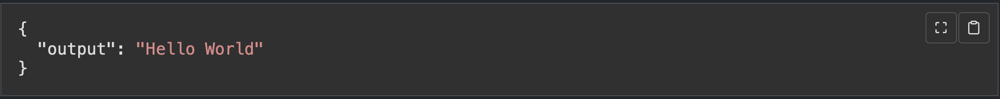

# highlightjs-fullscreen
A simple highlightjs plugin to add a fullscreenscreen button to your code blocks.



# Example
```html
<html>
  <head>
    <!-- Highlightjs -->
    <link rel="stylesheet" href="static/css/default.min.css" />
    <script src="static/js/highlight.min.js"></script>
    
    <!-- Highlightjs-Fullscreen -->
    <link rel="stylesheet" href="static/css/highlightjs-fullscreen.css" />
    <script src="static/js/highlightjs-fullscreen.js"></script>

    <!-- optional, Highlightjs-Copy (https://github.com/arronhunt/highlightjs-copy)  -->
    <link rel="stylesheet" href="static/css/highlightjs-copy.min.css" />
    <script src="static/js/highlightjs-copy.min.js"></script>

  </head>
  <body>
   <pre class="border">
      <code style="display: block; max-height: 30em; overflow: auto;" class="language-json">
      {"output": "Hello World"}
      </code>
    </pre>

    <script>
    // Enable Copy plugin (https://github.com/arronhunt/highlightjs-copy)
    hljs.addPlugin(new CopyButtonPlugin());

    // Enable FullScreen plugin
    hljs.addPlugin(new FullscreenButtonPlugin());

    // highlight all
    hljs.highlightAll();
    </script>
  </body>
</html>
```
